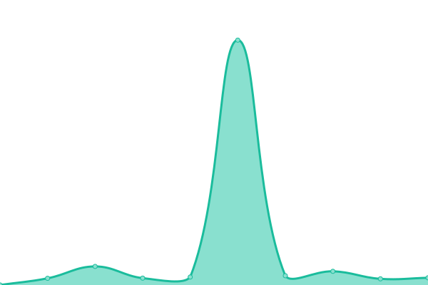
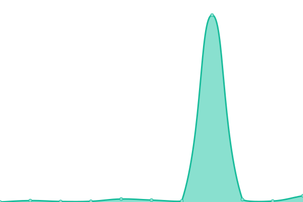
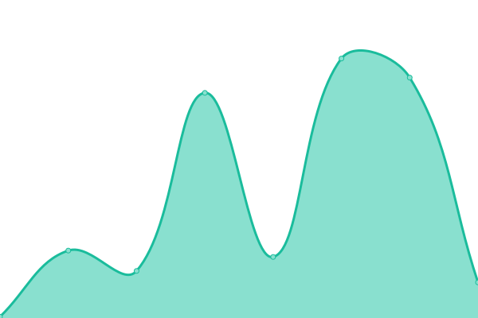

# [📈 Live Status](https://status.abusayed.dev): <!--live status--> **🟩 All systems operational**

This repository contains the open-source uptime monitor and status page for [Open Source Bangladesh](https://status.abusayed.dev), powered by [Upptime](https://github.com/upptime/upptime).

With [Upptime](https://upptime.js.org), you can get your own unlimited and free uptime monitor and status page, powered entirely by a GitHub repository. We use [Issues](https://github.com/opensourcebangladesh/status/issues) as incident reports, [Actions](https://github.com/opensourcebangladesh/status/actions) as uptime monitors, and [Pages](https://status.abusayed.dev) for the status page.

<!--start: status pages-->
<!-- This summary is generated by Upptime (https://github.com/upptime/upptime) -->
<!-- Do not edit this manually, your changes will be overwritten -->
<!-- prettier-ignore -->
| URL | Status | History | Response Time | Uptime |
| --- | ------ | ------- | ------------- | ------ |
|  [BeastsBay](https://beastsbay.com) | 🟩 Up | [beasts-bay.yml](https://github.com/opensourcebangladesh/status/commits/HEAD/history/beasts-bay.yml) | 

 209ms
     
 | 

<a href="https://status.abusayed.dev/history/beasts-bay">100.00%</a>
    

|  [ProFishingKit](https://profishingkit.com) | 🟩 Up | [pro-fishing-kit.yml](https://github.com/opensourcebangladesh/status/commits/HEAD/history/pro-fishing-kit.yml) | 

 123ms
     
 | 

<a href="https://status.abusayed.dev/history/pro-fishing-kit">100.00%</a>
    

|  [Nextshop.com.bd](https://www.nextshop.com.bd) | 🟩 Up | [nextshop-com-bd.yml](https://github.com/opensourcebangladesh/status/commits/HEAD/history/nextshop-com-bd.yml) | 

 299ms
     
 | 

<a href="https://status.abusayed.dev/history/nextshop-com-bd">99.46%</a>
    

|  [Abu Sayed](https://abusayed.dev) | 🟩 Up | [abu-sayed.yml](https://github.com/opensourcebangladesh/status/commits/HEAD/history/abu-sayed.yml) | 

 102ms
     
 | 

<a href="https://status.abusayed.dev/history/abu-sayed">100.00%</a>
    

|  [Abu Sayed(Blog)](https://blog.abusayed.dev) | 🟩 Up | [abu-sayed-blog.yml](https://github.com/opensourcebangladesh/status/commits/HEAD/history/abu-sayed-blog.yml) | 

 1152ms
     
 | 

<a href="https://status.abusayed.dev/history/abu-sayed-blog">100.00%</a>
    

|  [BGSHIP](https://bgship.com) | 🟩 Up | [bgship.yml](https://github.com/opensourcebangladesh/status/commits/HEAD/history/bgship.yml) | 

 545ms
     
 | 

<a href="https://status.abusayed.dev/history/bgship">100.00%</a>
    

|  [RIOM](https://riom.xyz) | 🟩 Up | [riom.yml](https://github.com/opensourcebangladesh/status/commits/HEAD/history/riom.yml) | 

 98ms
     
 | 

<a href="https://status.abusayed.dev/history/riom">100.00%</a>
    

|  [QDeal](https://qdeal.xyz) | 🟩 Up | [q-deal.yml](https://github.com/opensourcebangladesh/status/commits/HEAD/history/q-deal.yml) | 

 135ms
     
 | 

<a href="https://status.abusayed.dev/history/q-deal">100.00%</a>
    

<!--end: status pages-->

[**Visit our status website →**](https://status.abusayed.dev)

## 📄 License

- Powered by: [Upptime](https://github.com/upptime/upptime)
- Code: [MIT](./LICENSE) © [Open Source Bangladesh](https://status.abusayed.dev)
- Data in the `./history` directory: [Open Database License](https://opendatacommons.org/licenses/odbl/1-0/)
